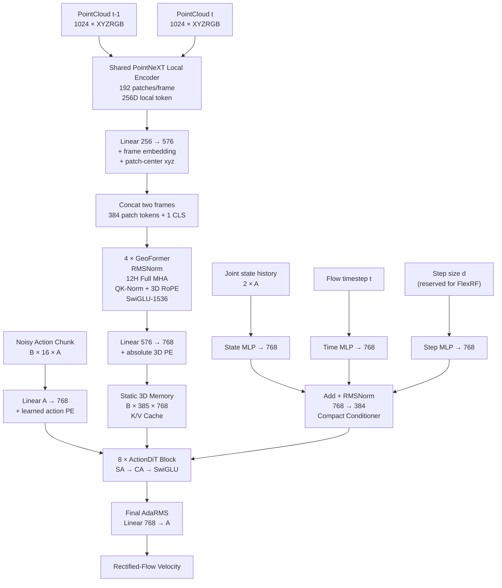

# ActionFlow 重构实施计划

> **适用仓库**：`dexmani_policy`  
> **目标读者**：Claude Code / 开发者  
> **目标模型**：最新 ActionFlow  
> **核心原则**：**简洁、高效、生成质量优先、架构清晰、可验证、不过度设计**

---

## 目录

1. [目标与实施原则](#1-目标与实施原则)
2. [最终架构总览](#2-最终架构总览)
3. [参数预算](#3-参数预算)
4. [文件结构与修改范围](#4-文件结构与修改范围)
5. [Phase 1：PointNeXT 收缩为 Local Tokenizer](#5-phase-1pointnext-收缩为-local-tokenizer)
6. [Phase 2：实现 GeoFormer](#6-phase-2实现-geoformer)
7. [Phase 3：构建 Two-Frame 3D Memory](#7-phase-3构建-two-frame-3d-memory)
8. [Phase 4：重写 ActionFlowDiT-80M](#8-phase-4重写-actionflowdit-80m)
9. [Phase 5：重构 ActionFlowAgent](#9-phase-5重构-actionflowagent)
10. [Phase 6：保持标准 Rectified Flow](#10-phase-6保持标准-rectified-flow)
11. [Phase 7：更新 Hydra 配置](#11-phase-7更新-hydra-配置)
12. [Phase 8：测试与工程验证](#12-phase-8测试与工程验证)
13. [Phase 9：NFE 评测](#13-phase-9nfe-评测)
14. [Phase 10：训练与实验顺序](#14-phase-10训练与实验顺序)
15. [后续 Ablation 顺序](#15-后续-ablation-顺序)
16. [FlexRF 启动条件](#16-flexrf-启动条件)
17. [代码风格与禁止事项](#17-代码风格与禁止事项)
18. [推荐 Commit 顺序](#18-推荐-commit-顺序)
19. [最终验收清单](#19-最终验收清单)
20. [给 Claude Code 的最终执行指令](#20-给-claude-code-的最终执行指令)

---

# 1. 目标与实施原则

本次直接**重构现有 `action_flow`**。

不需要：

- 保留旧 ActionFlow 模型；
- 保留旧接口；
- 保留旧 checkpoint 兼容性；
- 维护 ActionFlow-v1 / v2 / L 等并行实现；
- 为历史配置增加 compatibility branch。

最终目标架构：

\[
\boxed{
\text{PointNeXT Local}
\rightarrow
\text{4L GeoFormer}
\rightarrow
\text{Static 768D 3D Memory}
\rightarrow
\text{8L / 80M ActionDiT}
\rightarrow
\text{Rectified Flow}
}
\]

### 1.1 核心设计原则

- PointNeXT：只负责局部几何编码；
- GeoFormer：负责 patch-to-patch、frame-to-frame 3D relational reasoning；
- ActionDiT：负责动作时序协调和 action-to-geometry retrieval；
- State / timestep / step-size：只通过 global modulation 进入 ActionDiT；
- Geometry：只通过 Cross Attention 进入 ActionDiT；
- Observation memory：只计算一次并缓存 K/V；
- 第一阶段：只使用标准 Rectified Flow；
- 只有低 NFE 与高 NFE 差距明显时，才进一步启用 FlexRF。

### 1.2 原则上不要修改的公共路径

除非确有必要，不修改：

```text
datasets/
training/trainer.py
training/workspace.py
common/
```

`BaseAgent` 公共逻辑也应尽量保持不变；ActionFlow 的特殊接口在 `ActionFlowAgent` 内局部处理。

---

# 2. 最终架构总览



---

# 3. 参数预算

## 3.1 感知模块

目标：

\[
\boxed{15M \sim 19M}
\]

推荐配置：

```yaml
num_points: 1024
num_patches: 192
stem_channels: 128
local_token_dim: 256

geo_hidden_dim: 576
geo_depth: 4
geo_heads: 12
geo_ffn_dim: 1536

memory_dim: 768
absolute_3d_pe_dim: 96
```

参数应该主要投入 **GeoFormer relational reasoning**，而不是局部 PointMLP。

## 3.2 ActionDiT

目标：

\[
\boxed{79M \sim 82M}
\]

```yaml
hidden_dim: 768
context_dim: 768
depth: 8
num_heads: 12
num_kv_heads: 12
ffn_hidden_dim: 2048
cond_bottleneck_dim: 384
```

## 3.3 总参数

期望：

\[
\boxed{17M + 80M \approx 97M}
\]

允许：

\[
\boxed{95M \sim 101M}
\]

> 不要为了凑到恰好 `100.0M` 增加无意义参数。

---

# 4. 文件结构与修改范围

建议最终结构：

```text
dexmani_policy/
├── agents/
│   ├── core/
│   │   └── action_flow.py
│   ├── obs_encoder/
│   │   └── pointcloud/
│   │       ├── pointnext_tokenizer.py
│   │       ├── geoformer.py              # 新增
│   │       └── registry.py
│   └── action_decoders/
│       ├── action_flow_flowmatch.py
│       └── backbone/
│           └── action_flow_dit.py
├── configs/
│   ├── action_flow.yaml
│   └── ddp/
│       └── action_flow.yaml
├── smoke_test.py
└── scripts/
    └── eval/
        └── eval_action_flow_solvers.sh
```

允许直接重写：

```text
agents/core/action_flow.py
agents/action_decoders/backbone/action_flow_dit.py
agents/action_decoders/action_flow_flowmatch.py
configs/action_flow.yaml
configs/ddp/action_flow.yaml
scripts/eval/eval_action_flow_solvers.sh
```

新增：

```text
agents/obs_encoder/pointcloud/geoformer.py
```

---

# 5. Phase 1：PointNeXT 收缩为 Local Tokenizer

PointNeXT 只负责：

\[
\boxed{\text{local geometry extraction}}
\]

```yaml
pc_encoder_config:
  num_patches: 192
  stem_channels: 128
  token_channels: 256
  patch_radii: [0.04, 0.08]
  patch_neighbors: [16, 32]
  use_patch_self_attn: false
```

输出：

```text
patch_tokens:  [BT, 192, 256]
patch_centers: [BT, 192, 3]
```

不要请求 global token，也不要再次开启 tokenizer 内部 patch Transformer。

---

# 6. Phase 2：实现 GeoFormer

新增：

```text
dexmani_policy/agents/obs_encoder/pointcloud/geoformer.py
```

## 6.1 Shape Contract

```python
class GeoFormer(nn.Module):
    """
    Args:
        tokens: [B, N, 576]
        xyz:    [B, N, 3]

    Returns:
        tokens: [B, N, 576]
    """
```

GeoFormer 不应该知道 `joint_state`、action、flow timestep、NFE 或 robot FK。

## 6.2 GeoFormer Block

```text
RMSNorm
   ↓
Full Self-Attention
  ├─ QK-Norm
  ├─ 3D RoPE
  └─ PyTorch SDPA
   ↓
Residual
   ↓
RMSNorm
   ↓
SwiGLU
   ↓
Residual
```

```yaml
hidden_dim: 576
depth: 4
num_heads: 12
head_dim: 48
ffn_hidden_dim: 1536
qk_norm: true
dropout: 0.0
```

不要加入 AdaLN、zero gate、cross-attention、linear attention 或 MoE。

## 6.3 3D RoPE

每个 head：

\[
48 = 16_x + 16_y + 16_z
\]

实现约束：

```python
assert head_dim % 6 == 0
```

`sin/cos/frequency` 使用 FP32 计算，最后 cast 回原 dtype。

不要做每个 point cloud 独立 mean/std normalization，应保证相同物理距离在不同 episode 中映射为相同 rotary phase。

## 6.4 Attention

使用：

```python
torch.nn.functional.scaled_dot_product_attention
```

不要手写 softmax，也不要增加第三方 attention 依赖。

## 6.5 SwiGLU

\[
FFN(x)=W_o[SiLU(W_gx)\odot W_vx]
\]

```text
576 → 1536 gate
576 → 1536 value
1536 → 576 output
```

---

# 7. Phase 3：构建 Two-Frame 3D Memory

恢复 observation time：

```python
B = BT // self.n_obs_steps

patch_tokens = patch_tokens.reshape(
    B, self.n_obs_steps, 192, 256
)
patch_centers = patch_centers.reshape(
    B, self.n_obs_steps, 192, 3
)
```

## 7.1 Local → Geo

```python
self.local_to_geo = nn.Linear(256, 576)
```

## 7.2 Frame Embedding

```python
self.frame_embedding = nn.Parameter(
    torch.randn(2, 576) * 0.02
)
```

## 7.3 联合两帧

```text
frame t-1: 192 patches ┐
                       ├── concat → 384 tokens → GeoFormer
frame t:   192 patches ┘
```

不要逐帧分别运行 GeoFormer。

## 7.4 CLS

```text
384 patch + 1 CLS = 385 tokens
```

CLS xyz 使用 `[0,0,0]`。

## 7.5 输出 Memory

```text
[B,385,576]
 ↓ Linear 576→768
[B,385,768]
```

## 7.6 Absolute 3D PE

复用 `SinusoidalPosEmb3D`：

```text
xyz → SinusoidalPosEmb3D(96) → Linear 96→768
```

3D RoPE 负责相对 geometry，absolute PE 负责 workspace location。

## 7.7 State 不进入 Geometry

Observation encoder 返回：

```python
cond = {
    "memory": memory,
    "state": state_history,
}
```

其中：

```text
memory: [B,385,768]
state:  [B,2*A]
```

joint 模式 `[B,38]`，EE 模式 `[B,42]`。

---

# 8. Phase 4：重写 ActionFlowDiT-80M

直接重构：

```text
agents/action_decoders/backbone/action_flow_dit.py
```

固定：

```yaml
hidden_dim: 768
context_dim: 768
depth: 8
num_heads: 12
num_kv_heads: 12
ffn_hidden_dim: 2048
qk_norm: true
dropout: 0.0
```

## 8.1 Action Input

```text
[B,16,A] → Linear A→768 + learned action PE
```

保持 learned absolute PE。

## 8.2 Self Attention

```text
768 hidden
12 heads
64D/head
non-causal
QK-Norm
SDPA
```

## 8.3 Cross Attention

```text
query_dim   = 768
context_dim = 768
12Q / 12KV
64D/head
```

第一版不要 GQA。

## 8.4 Static KV Cache

每层支持：

```python
setup_kv_cache(context)
clear_kv_cache()
```

不同 NFE 重复使用同一 observation K/V。

## 8.5 SwiGLU

```text
768 → 2048 gate
768 → 2048 value
2048 → 768 output
```

---

# 9. Global Conditioning

全局条件：

```text
joint state history
flow timestep t
step size d
```

Geometry 不走 modulation。

## 9.1 State

```text
2A → 256 → SiLU → 768
```

## 9.2 Time

```text
128D sinusoidal → MLP → 768
```

## 9.3 Step

```text
64D sinusoidal → MLP → 768
```

Baseline：

```python
step_size = 0.0
```

Step MLP 最后一层 zero-init。

## 9.4 Fusion

\[
e=RMSNorm(e_{state}+e_t+e_d)
\]

不要 concat。

---

# 10. Compact Conditioner

```text
768 → Linear 384 → SiLU → 384D latent
```

## 10.1 Layer Calibration

每层：

```python
gamma_l = nn.Parameter(torch.zeros(384))
beta_l  = nn.Parameter(torch.zeros(384))
```

\[
h_l=(1+\gamma_l)\odot h+\beta_l
\]

## 10.2 Shared Block Modulation

```text
384 → 9 × 768
```

输出：

```text
SA:   scale / shift / gate
CA:   scale / shift / gate
FFN:  scale / shift / gate
```

## 10.3 Final Modulation

```text
384 → 2 × 768
```

---

# 11. ActionDiT Block

保持：

```python
x = x + gate_sa * self_attn(
    ada_rms(x, scale_sa, shift_sa)
)

x = x + gate_ca * cross_attn(
    ada_rms(x, scale_ca, shift_ca),
    context,
)

x = x + gate_ffn * swiglu(
    ada_rms(x, scale_ffn, shift_ffn)
)
```

即：

\[
\boxed{SA \rightarrow CA \rightarrow FFN}
\]

不要加入 parallel SA/CA、Differential Attention、MMDiT、MoE、long skip 或 Sandwich Norm。

---

# 12. 初始化规范

- 普通 Linear：Xavier；
- Learned Action PE：`normal_(std=0.02)`；
- Block modulation output：zero-init；
- Final modulation output：zero-init；
- Layer gamma/beta：0；
- Action output head：zero-init。

目标：

\[
gate_{SA}=gate_{CA}=gate_{FFN}=0
\]

---

# 13. 参数预算检查

实现后必须打印：

```python
def count_params(module):
    return sum(p.numel() for p in module.parameters())
```

| 模块 | 参数 |
|---|---:|
| Perception | 15M–19M |
| ActionDiT | 79M–82M |
| Total | 95M–101M |

如果 ActionDiT > 82M，先检查 conditioner / projection 是否重复。

不要优先压缩 `context_dim=768`、`num_kv_heads=12` 或 `ffn_hidden_dim=2048`。

---

# 14. Phase 5：重构 ActionFlowAgent

继续：

```python
class ActionFlowAgent(BaseAgent):
    ...
```

不创建新 Agent。

由于 `cond` 是 dict，在 `ActionFlowAgent` 局部 override：

```python
predict_action_from_cond()
```

不要为此修改公共 BaseAgent。

---

# 15. Optimizer

第一轮保持：

```yaml
optimizer:
  lr: 1.0e-4
  obs_lr: 1.0e-4
  weight_decay: 1.0e-3
  obs_weight_decay: 1.0e-6
  betas: [0.9, 0.95]
```

不要同时改变 architecture 和 optimizer。

---

# 16. Phase 6：保持标准 Rectified Flow

\[
\epsilon\sim\mathcal N(0,I)
\]

\[
x_t=(1-t)\epsilon+ta
\]

\[
v^*=a-\epsilon
\]

\[
L_{RF}=MSE(v_\theta,v^*)
\]

## 16.1 Timestep Sampler

```yaml
noise_shift_alpha: 3.0
noise_shift_ratio: 0.75
```

即 `75% NoiseShift(alpha=3) + 25% Uniform`。

不要加入 solver anchor、Midpoint correction、consistency、EMA teacher、Shortcut 或 MeanFlow。

## 16.2 Model Call

```python
pred = model(
    x=xt,
    timestep=t,
    context=cond["memory"],
    state=cond["state"],
    step_size=0.0,
)
```

## 16.3 推理

第一阶段主要评测：

```text
Euler-1
Midpoint-2
Midpoint-4
Midpoint-8
Midpoint-10
```

---

# 17. Phase 7：Hydra 配置

核心：

```yaml
agent:
  _target_: dexmani_policy.agents.core.action_flow.ActionFlowAgent

  horizon: ${horizon}
  n_obs_steps: ${n_obs_steps}
  n_action_steps: ${n_action_steps}

  action_dim: ${action_dim}
  state_dim: ${action_dim}
  pc_dim: 6
  num_points: 1024

  pc_encoder_config:
    num_patches: 192
    stem_channels: 128
    token_channels: 256
    patch_radii: [0.04, 0.08]
    patch_neighbors: [16, 32]
    use_patch_self_attn: false

  geo_hidden_dim: 576
  geo_depth: 4
  geo_num_heads: 12
  geo_ffn_hidden_dim: 1536
  geo_qk_norm: true
  geo_use_3d_rope: true
  absolute_3d_pe_dim: 96

  hidden_dim: 768
  context_dim: 768
  depth: 8
  num_heads: 12
  num_kv_heads: 12
  ffn_hidden_dim: 2048

  timestep_embed_dim: 128
  step_embed_dim: 64
  state_embed_hidden_dim: 256
  cond_bottleneck_dim: 384

  qk_norm: true
  attn_drop: 0.0

  denoise_steps: 2
  solver: midpoint
  noise_shift_alpha: 3.0
  noise_shift_ratio: 0.75
```

保留：

```yaml
horizon: 16
n_obs_steps: 2
n_action_steps: 8

training:
  use_bfloat16: true
  use_compile: true
  use_ema: true
  lr_scheduler: cosine
  max_grad_norm: 1.0

  loop:
    total_train_steps: 100000
```

---

# 18. Phase 8：测试与工程验证

运行：

```bash
python dexmani_policy/smoke_test.py action_flow
```

额外输出：

```text
[ActionFlow]
perception params: ...
backbone params: ...
total params: ...
memory shape: ...
state shape: ...
```

## 18.1 GeoFormer Tests

- Shape `[B,385,576] → [B,385,576]`
- finite backward
- BF16 无 NaN
- `torch.compile` 可运行

## 18.2 Permutation Test

patch tokens 与 xyz 使用同一 permutation，逆 permutation 后输出应近似一致；CLS 不参与 shuffle。

## 18.3 KV Cache Parity

```python
out_uncached = model(...)

model.setup_kv_cache(memory)
out_cached = model(...)
model.clear_kv_cache()

torch.testing.assert_close(out_cached, out_uncached)
```

建议 tolerance：

```text
FP32 : ~1e-5
BF16 : ~1e-2
```

---

# 19. Phase 9：NFE 评测

主集合：

```text
Euler-1
Midpoint-2
Midpoint-4
Midpoint-8
Midpoint-10
```

第一轮：

```text
25 paired episodes
```

重要 checkpoint：

```text
100 paired episodes
```

固定同 checkpoint / seeds / EMA / environment randomization。

定义：

\[
G_2=SR_{10}-SR_2
\]

\[
R_2=
\frac{SR_2-SR_1}
{SR_{10}-SR_1}
\]

目标：

\[
\boxed{G_2\le3\%\sim5\%}
\]

\[
\boxed{R_2\ge0.75}
\]

---

# 20. Phase 10：训练顺序

## Run 0 — Smoke

```bash
python dexmani_policy/smoke_test.py action_flow
```

## Run 1 — 1000-step sanity

```bash
bash scripts/training/train.sh \
  action_flow \
  pick_apple_messy \
  'training.loop.total_train_steps=1000'
```

确认：

- [ ] loss 正常
- [ ] 无 NaN
- [ ] 显存合理
- [ ] compile 正常
- [ ] EMA 正常
- [ ] checkpoint 正常

## Run 2 — 正式 100k

```bash
bash scripts/training/train.sh \
  action_flow \
  pick_apple_messy
```

或：

```bash
bash scripts/training/train_ddp.sh \
  ddp/action_flow \
  pick_apple_messy
```

---

# 21. 后续 Ablation 顺序

完整模型稳定后再做：

1. **12Q/12KV vs 12Q/6KV**：验证 GQA efficiency；
2. **GeoFormer 4L vs 2L**：验证 relational depth；
3. **Joint 384-token vs per-frame GeoFormer**：验证 temporal relation；
4. **Compact conditioner vs +Rank16 adapter**：只在 conditioner capacity 存疑时；
5. **8L vs 10L 等参数版本**：验证 depth/width Pareto。

---

# 22. FlexRF 启动条件

只有：

\[
\boxed{SR_{10}-SR_2>5\%}
\]

才继续实现 FlexRF。

如果：

\[
SR_2\approx SR_{8/10}
\]

则保留标准 RF。

---

# 23. 代码风格

优先：

```text
small explicit classes
clear tensor-shape contracts
assert dimensions
PyTorch SDPA
RMSNorm
few branches
config-driven dimensions
local overrides
```

避免：

```text
factory abstraction for one implementation
generic plugin system
deep inheritance
duplicate config objects
magic shape inference
huge utility modules
```

---

# 24. 明确禁止

不要：

- 保留旧 ActionFlow compatibility branch；
- 创建 ActionFlowV2 / ActionFlowL 并行模型；
- 修改 Dataset；
- 修改 Trainer；
- 引入 ManiFlow consistency；
- PointNeXT 内再次开启 patch Transformer；
- state broadcast 到 geometry；
- 第一版使用 GQA；
- Linear Attention；
- MoE；
- Mamba；
- Differential Attention；
- MMDiT；
- Dynamic Token；
- 第一版加入 robot FK grounding；
- 第一版启用 FlexRF；
- 为了恰好 100M 堆参数。

---

# 25. 推荐 Commit 顺序

```text
C1
refactor(action-flow): simplify PointNeXT into local patch tokenizer

C2
feat(action-flow): add joint two-frame 3D GeoFormer

C3
refactor(action-flow): build static 768D geometry memory

C4
refactor(action-flow): replace backbone with 8-layer 80M ActionDiT

C5
feat(action-flow): add compact state-time-step conditioner and KV cache

C6
refactor(action-flow): integrate standard rectified-flow decoder

C7
test(action-flow): add GeoFormer, parameter and KV-cache checks

C8
config(action-flow): update single-GPU and DDP configs

C9
eval(action-flow): support NFE 1 2 4 8 10

C10
docs(action-flow): update architecture and usage
```

---

# 26. 最终验收清单

## Perception

- [ ] Input = `2 × 1024 XYZRGB`
- [ ] FPS = `192 patches / frame`
- [ ] Local token = `256D`
- [ ] PointNeXT internal patch self-attention disabled
- [ ] Two frames jointly processed
- [ ] GeoFormer = exactly `4 layers`
- [ ] GeoFormer hidden = `576`
- [ ] GeoFormer heads = `12`
- [ ] GeoFormer FFN = `1536`
- [ ] QK-Norm enabled
- [ ] 3D RoPE enabled
- [ ] Output = `384 patch + 1 CLS`
- [ ] Memory width = `768`
- [ ] Absolute 3D PE retained
- [ ] State not broadcast
- [ ] Perception params ≈ `15M–19M`

## ActionDiT

- [ ] Action tokens = `16`
- [ ] Hidden = `768`
- [ ] Depth = exactly `8`
- [ ] Self-attention = `12 heads`
- [ ] Cross-attention = `12Q / 12KV`
- [ ] Context = `768`
- [ ] SwiGLU hidden = `2048`
- [ ] RMSNorm / AdaRMS
- [ ] QK-Norm
- [ ] Non-causal SA
- [ ] Compact conditioner = `384`
- [ ] Zero-gated residual
- [ ] Action output zero-init
- [ ] KV cache parity passed
- [ ] ActionDiT params ≈ `79M–82M`

## Flow

- [ ] Standard Rectified Flow
- [ ] Velocity target = `action - noise`
- [ ] `75% NoiseShift + 25% Uniform`
- [ ] `alpha = 3`
- [ ] Euler supported
- [ ] Midpoint supported
- [ ] NFE `1 / 2 / 4 / 8 / 10` evaluable
- [ ] No EMA teacher
- [ ] No consistency loss
- [ ] FlexRF disabled initially

## Engineering

- [ ] `smoke_test.py action_flow` passes
- [ ] BF16 forward/backward passes
- [ ] `torch.compile` passes
- [ ] EMA works
- [ ] Checkpoint save/load passes
- [ ] DDP builds and trains
- [ ] Optimizer covers all trainable parameters
- [ ] No unused trainable parameters
- [ ] No NaN / Inf
- [ ] Parameter counts logged
- [ ] GeoFormer permutation test passed
- [ ] KV cache parity test passed

---

# 27. 完整开发路径

```text
PointNeXT → pure local tokenizer
        │
        ▼
GeoFormer + 3D RoPE
        │
        ▼
Joint two-frame perception
        │
        ▼
385 × 768 static geometry memory
        │
        ▼
8L / 80M ActionDiT
        │
        ▼
Compact conditioner + KV cache
        │
        ▼
Standard Rectified Flow
        │
        ▼
Smoke / BF16 / Compile / EMA
        │
        ▼
1000-step sanity
        │
        ▼
100k full training
        │
        ▼
NFE = 1 / 2 / 4 / 8 / 10
        │
        ▼
SR10 - SR2 ≤ 5% ?
      /          \
    YES          NO
     │            │
     ▼            ▼
   STOP         FlexRF
```

---

# 28. 给 Claude Code 的最终执行指令

> **直接重构当前 `action_flow`。不要保留旧模型、旧 checkpoint、旧接口或 compatibility branch，也不要创建新的 ActionFlowV2 / ActionFlowL 并行实现。**
>
> 1. 将 PointNeXT 收缩为纯 local patch tokenizer：每帧 1024 点 → 192 patches，local token 256D，关闭 tokenizer 内部 patch self-attention。
> 2. 新增 4-layer、576D、12-head GeoFormer，使用 RMSNorm、QK-Norm、3D RoPE、Full SDPA 和 SwiGLU-1536。两个 observation frame 的 384 个 patch 必须联合进入同一个 GeoFormer。
> 3. GeoFormer 输出经过 576→768 projection，并保留 absolute 3D PE，形成 `[B,385,768]` static geometry memory。
> 4. Joint state 不再 broadcast 到 geometry token，而是保留两帧 state history `[B,2A]`，作为 ActionDiT global condition。
> 5. 重写 `ActionFlowDiT`：exactly 8 layers、hidden=768、context=768、12-head full action SA、12Q/12KV full geometry CA、SwiGLU-2048；block 严格保持 `SA → CA → FFN`。
> 6. State / flow timestep / step size 分别 embedding 到 768D，求和后进入 `768→384` compact conditioner；每层只在 384D conditioner latent 上做轻量 affine calibration，并通过共享 zero-initialized modulation head 产生 AdaRMS scale/shift/gate。
> 7. Cross-attention K/V 必须支持 static cache，并增加 cached/uncached parity test。
> 8. ActionDiT 参数目标为 79M–82M，感知目标为 15M–19M，总参数约 0.1B。不要为了参数预算压缩 768D geometry interface、12KV 或 SwiGLU-2048。
> 9. 第一阶段继续使用标准 Rectified Flow：`x_t=(1-t)noise+t*action`，target=`action-noise`，75% NoiseShift(alpha=3)+25% Uniform；不加入 consistency、teacher、Shortcut、MeanFlow 或 Midpoint-specific loss。
> 10. 完成后必须通过 smoke test、BF16 backward、torch.compile、EMA、checkpoint roundtrip、GeoFormer permutation test、KV-cache parity，并支持 NFE=1/2/4/8/10 的统一评测。
> 11. **只有当 `SR10 - SR2 > 5%` 时，才开始实现 FlexRF。**

---

# 29. 最终冻结架构

\[
\boxed{
\textbf{PointNeXT}_{local,\,192\times256}
\rightarrow
\textbf{GeoFormer}_{4L\times576}
\rightarrow
\textbf{Static Memory}_{385\times768}
\rightarrow
\textbf{ActionDiT}_{8L,\sim80M}
\rightarrow
\textbf{Rectified Flow}
}
\]

### ActionDiT Block

\[
\boxed{
AdaRMS
\rightarrow SA
\rightarrow AdaRMS
\rightarrow CA
\rightarrow AdaRMS
\rightarrow SwiGLU
}
\]

### Condition 分工

\[
\boxed{Geometry \rightarrow CrossAttention}
\]

\[
\boxed{State + Time + Step \rightarrow Global Modulation}
\]

### 推理原则

\[
\boxed{
\text{Observation encode once}
+
\text{Static K/V cache}
+
\text{NFE-dependent action-only iteration}
}
\]

> 在完成并验证这条主线之前，不继续增加额外生成机制。
