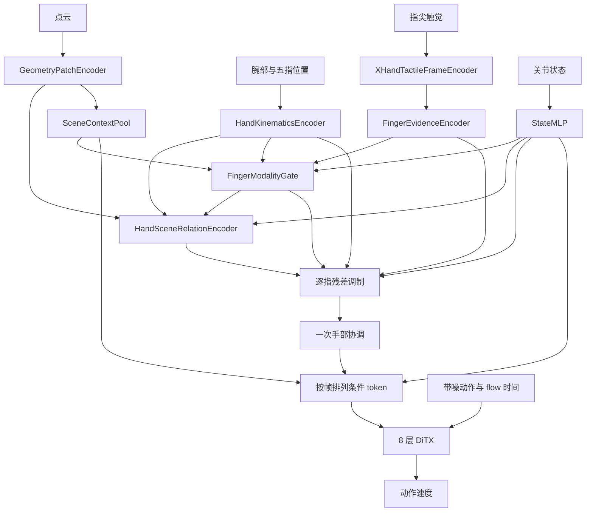

# 逐指交互表征：研究主线与实现

调研截止：2026-10-10。
本文区分论文已报告机制、当前代码行为和待验证研究假设；没有闭环实验结果时不声称性能提升。

## 1. 研究问题

灵巧操作需要同时判断三件事：可见表面在哪里、哪根手指能作用于它、该手指当前感受到什么。
点云提供可见几何；运动学提供腕部和指尖的位置关系；触觉提供局部物理交互的测量。
它们不是互相替代的传感器。例如，指尖到最近可见点很近，不足以证明已建立接触；接触读数也不能恢复被遮挡物体的完整几何。

当密集点云被压缩成少量策略条件后，后端网络需要从这些条件中恢复“哪根手指—哪部分几何—哪种触觉状态”的对应关系。
我们研究的瓶颈是：**有限的交互 token 应在什么阶段、按照什么空间粒度整合这些证据？**
这是一项待验证的结构假设，不是关于所有独立编码方法必然失败的结论。

核心假设：在 patch 到身体锚点 token 的空间聚合阶段，用当前逐指触觉参与同指几何读取，
同时保留该触觉的直接残差，可能比几何聚合完成后的晚期融合更适合接触建立和调整。
无接触时的收益应主要来自身体位置与几何对应；实时触觉通常不能提前指出尚未触碰的目标位置。

同时需要区分**融合位置**与**融合强度**：模态的任务价值随交互状态改变，同一时刻不同手指也可能承担不同作用。
AdapTac 报告了到达阶段更重视觉、操作阶段更重触觉的 attention 变化；这支持考虑动态调制，但不构成固定阶段切换规则或门值的因果解释。
本版加入读取前的逐指模态门控，让视觉几何与触觉贡献随当前状态变化；不预测离散阶段，也不预设接触后视觉失效。

建议工作标题：**Touch-Conditioned Hand–Scene Relations for Dexterous Manipulation**。
研究目标仍是手–物交互；代码使用 `HandScene`，因为输入尚未要求可靠物体分割，也不能保证已去除机器人自身点云。

## 2. 相关工作的约束，而非模块拼接

| 研究线索 | 一手来源中的机制 | 对本研究的实际约束 |
|---|---|---|
| [PointNet++](https://arxiv.org/abs/1706.02413)，2017 | 米制邻域中的层级局部聚合 | 复用 FPS/KNN patch；固定 K 不代表固定物理接触半径 |
| [Point Transformer](https://arxiv.org/abs/2012.09164)，2021 | 相对位置参与局部 attention 权重和 value | 保留关系层的几何 bias/value；不把位置 MLP 当新贡献 |
| [Perceiver](https://proceedings.mlr.press/v139/jaegle21a.html)，2021 | 小 latent 集通过 cross-attention 读取大量输入 | 小 token 瓶颈有方法基础，也可能损失任务细节 |
| [Multimodal Bottleneck Transformer](https://proceedings.neurips.cc/paper/2021/hash/76ba9f564ebbc35b1014ac498fafadd0-Abstract.html)，2021 | 少量共享 latent 限制模态间交换 | 区分直接编码与交互融合；压缩本身不构成新颖性 |
| [3D Diffuser Actor](https://arxiv.org/abs/2402.10885) | 带三维位置的场景与动作 token 交互 | 保留多个场景 token；本策略的 joint-action DiTX 不自动获得其空间性质 |
| [DexRepNet++](https://arxiv.org/abs/2602.21811)、[CordViP](https://arxiv.org/abs/2502.08449) | 显式手–物几何，或接触/协调表征学习 | 手–物相对表示和接触建模已有充分先例 |
| [FINGR](https://arxiv.org/html/2609.33973v2) | 逐指相对几何及多时间跨度交互预测 | 逐指相对坐标、flow、未来交互预测都不能单独作为新贡献 |
| [FingerViP](https://arxiv.org/html/2604.21331v1)、[SaTA](https://arxiv.org/html/2510.14647v2) | 逐指感知与位姿对应；或腕部相对传感器位姿调制触觉 | 身体锚定已有先例。本文只有指尖位置，不能假设每个 taxel 的完整位姿 |
| [ThinkProprio](https://arxiv.org/html/2602.06575v2)、[GeoProp](https://arxiv.org/html/2607.07101v1) | 状态参与视觉选择，或末端位置引导局部视觉 | “状态引导感知”已经存在；本版不加入运动外推或 hard pruning |
| [AdapTac](https://arxiv.org/html/2505.13982v1) | 观测/预测力引导视触觉 attention | “力引导融合”不是新贡献；其统一坐标合力依赖 taxel 位姿，不能照搬硬件通道 |
| [TransDex](https://arxiv.org/html/2603.13869v1) | 触觉力 query 多轮读取已编码的全局、局部手–物及触觉位置分支 | “触觉作为 query”已有直接先例；本研究需验证逐指 patch 聚合的粒度与位置 |
| [TACIT](https://arxiv.org/html/2609.24507v1) | 用示范接触中心监督较早点云的空间注意力，注意力头推理时看相机点 | 接触引导空间注意力也已有先例；本版用当前触觉 query，不使用未来接触标签 |
| [FingerEye](https://arxiv.org/html/2604.20689v3)、[DeCAL](https://arxiv.org/html/2609.09119v1) | 分组模态处理，或局部触觉读取与全局门控 | 引入一个逐指模态门控，单独检验融合强度；不引入预测体系 |
| [MoPA](https://mopa-policy.github.io/)、[GeoHAT](https://icr-lab.github.io/GeoHAT/) | 为不同执行部件组织感知/动作交互 | 支持按身体作用位置组织证据的动机，不代表本模型学习了语义动作角色 |
| [ProxiDex](https://arxiv.org/abs/2609.16586)、[UniDex](https://arxiv.org/abs/2603.22264)、[TacEx](https://arxiv.org/abs/2609.40134) | 邻近状态建模、功能执行器表示、或触觉探索 | proximity 不等于真实接触；当前 attention 不是主动探索，也没有角色标签监督 |

2026 年条目按所链接版本讨论；未在此表核实正式 venue 的工作按预印本机制参考，不依据时间推断录用。

## 3. 可提交论文的候选贡献

1. **表征粒度**：以腕部和五个指尖作为稳定身体索引，将可见几何和同指触觉保留为六个交互 token，另保留场景上下文。
2. **融合位置**：在共享直接触觉残差的前提下，让当前触觉参与 patch→身体锚点的空间聚合，并提供完全同参数的晚期融合对照。
3. **证据与实验**：分别处理几何邻近、真实传感器读数、无局部观测和缺失传感器，检验这种组织方式在接触歧义与局部遮挡下的效果。

这些贡献围绕同一个问题。第二项与第一项的联合效果需要闭环实验支撑；缺失 mask、普通 sigmoid 门控和目录重构不应拆成独立算法贡献。
不使用“首次触觉引导注意力”“首次手部锚定”“完整 SE(3) 等变”“重建真实接触场”等表述。

## 4. 最小架构

每帧默认 `128 × 192` 点云 patch，经两条路径压缩为 `16 + 6 + 1 = 23` 个条件 token。
两帧历史形成 `[B,46,192]`；历史不在触觉 encoder 中提前压成一帧。



令 `k_i` 为身体运动学 token，`s` 为状态编码，`e_i` 为同指触觉证据；腕部 `e_0=0`。
两种融合使用完全相同的参数：

\[
q_i^{Q}=k_i+s+g_i^t e_i,\qquad q_i^{L}=k_i+s,
\]
\[
u_i=\operatorname{ReadGeometry}(q_i),\qquad
z_i=\operatorname{LN}_{out}\!\left(\operatorname{HandAttention}
(\operatorname{LN}_{in}(k_i+s+g_i^t e_i+g_i^v u_i))\right).
\]

区别仅在 `ReadGeometry` 是否收到触觉。Q/L 使用相同读取前输入计算 gain，保留同一触觉直接路径，归一化顺序相同，手部协调次数相同。
关闭 `use_modality_gate` 后，五指的 gain 固定为 1（缺失触觉仍为 0），恢复原融合形式。

### 当前交互状态条件的模态调制

`FingerModalityGate` 接收读取前的运动学+状态、同指触觉证据、共享场景摘要、规范化 contact_force 和有效位：

\[
(g_i^v,g_i^t)=2\sigma(f_\theta(k_i+s,e_i,\bar c,\tilde f_i,m_i)),\qquad
 g_i^t\leftarrow m_i g_i^t.
\]

- 两个 gain 独立，范围为 0 到 2，允许两种模态同时增强。输出层零初始化，初始 gain=1，延续原融合幅度。
- 门控 MLP 跟随 autocast；FP16/BF16 logits 转为 FP32 后计算并保留 gain，避免单位增益附近的小幅更新被舍入。仅有有限 loss 或非零梯度不足以证明前向增益实际发生变化。
- 几何 gain 控制逐指关系更新；触觉 gain 同时控制 query 注入与直接残差。
- 16 个 scene token 保留，腕部固定 geometry gain=1、tactile gain=0。
- 门控不接收 relation_update、attention 或 null mass，避免 Q/L 的读取结果反过来改变残差对照。
- 规范化 contact_force 保留幅度通道；只对触觉 embedding 做 LayerNorm 会弱化这部分信息。无效通道先 mask 再送入 MLP，避免 NaN 污染视觉 gain。
- 门值是特征调制强度，不是接触概率、可信度或经校准的模态重要性。当前门没有时序输入；两帧 DiTX 能使用历史，不等于门本身已识别接触建立/释放的方向。

以下是设计预期，不是硬编码策略或已经观察到的结果：

| 交互状态 | 视觉几何的作用 | 触觉的作用 |
|---|---|---|
| 接近 | 目标、可达表面及指尖对齐 | 有效零接触与意外碰触信息 |
| 接触建立 | 几何对齐与物体位姿 | 接触出现、局部载荷反馈 |
| 保持与调整 | 目标进展、整体姿态、环境约束 | 局部接触变化与稳定性相关读数 |
| 释放与重新接触 | 下一个接触位置 | 卸载和是否仍存在接触 |

同一时刻，支撑手指与移动手指的模态需求可能不同，因此采用逐指 gain，不给整只手规定一个全局视觉/触觉开关。

### 几何读取

- `context` 读取经过 patch self-attention 的特征，边使用锚点到 patch 中心的位置关系，较宽高斯尺度保留上下文。
- `near` 读取未全局混合的 local patch 特征，边使用锚点到 patch 最近可见成员的向量与距离。
- 默认 context 各头尺度为 `0.08/0.08/0.20/∞ m`，near 为 `0.015/0.015/0.04/0.04 m`，near 截断为各尺度的三倍。这些是初始超参数，尚未验证最优。
- 两者均有 null key/value；near 额外使用确定性的局部支撑 mask。全部无支撑时 near update 严格为零，即使 null/value/output bias 已被学习。
- near 路径通过距离 bias、半径支持和 null 控制几何读取，关系更新再由逐指 geometry gain 调制。

默认关系向量为 `R_wrist^T (p-c_i)`，距离仍以米表示；场景与状态继续保留基坐标系信息。
仅旋转边向量不会使包含世界轴 patch/RoPE、绝对状态和动作头的网络整体等变。

### 触觉与缺失

`XHandTactileFrameEncoder` 直接编码每帧每指数据：聚合三通道使用已有 MLP；120 taxel 阵列复用已有 ArrayEncoder。
`FingerEvidenceEncoder` 将 frame 特征和归一化的聚合读数投影到 token 维度，加入有效读数标记，并把无效指证据严格置零。
三通道读数保留其传感器语义，不旋转成未标定的世界系力，也不假定 taxel 的完整姿态。

有效零接触读数与传感器缺失不同。默认所有输入有效；可显式启用 bool `tactile_valid`。
训练期 `tactile_dropout_prob` 在样本/手指层采样有效位，并在同一历史窗口共享，不通过把坐标或原始读数直接乘零来模拟缺测。
当前 dataset 的有限值过滤会拒绝包含 NaN 的数据窗口；normalizer 也不会按有效位排除有限占位值。
因此，encoder 的缺测屏蔽不能替代数据过滤与统计拟合的缺测处理，含缺测污染的数据不能直接用于当前训练链路。
主消融优先在正常归一化后使用 `tactile_dropout_prob`，保持 Q/L 的统计与缺测分布一致。

### 动作生成

保持已有标准 flow matching：`x_t=(1-t)noise+t*action`，目标速度为 `action-noise`。
复用 `RectifiedFlow`、时间采样器和原 Euler 推理；`time_shift_alpha` 只改变训练时间采样。
`DiTX` 复用已有 DiTXBlock/FinalLayer，策略固定八层，仅使用当前 flow 时间条件。
动作布局、归一化、执行窗口沿用 BaseAgent。无未来预测辅助损失、动作角色分类、VLM 或新增动作分解。

## 5. 文件与职责

以下路径相对 `dexmani_policy/agents/obs_encoder/`；已有其他基线保持各自入口。

| 文件 / 类 | 职责 |
|---|---|
| `pointcloud/geometry_patch.py` / GeometryPatchEncoder | 直接点云 patch 编码 |
| `proprio/hand_kinematics.py` / HandKinematicsEncoder | 直接腕部/指尖运动学编码 |
| `tactile/xhand_frame.py` / XHandTactileFrameEncoder | 直接逐帧触觉编码 |
| `interaction/hand_scene_relation.py` / HandSceneRelationEncoder | 身体锚定的几何关系读取 |
| `interaction/scene_context.py` / SceneContextPool | 场景上下文汇聚 |
| `interaction/attention.py` | GeometryCrossAttention、InteractionSelfAttentionBlock |
| `interaction/finger_evidence.py` / FingerEvidenceEncoder | 逐指触觉证据与有效位 |
| `interaction/modality_gate.py` / FingerModalityGate | 读取前计算逐指独立几何/触觉 gain，支持单位 gain 对照 |
| `interaction/point_image_fusion.py` / PointImageFusion | 可选 RGB–point patch 融合；当前策略不启用 |
| `interaction/encoder.py` / InteractionObsEncoder | Q/L 开关、统一残差、手部协调、frame-major 输出 |

策略入口为 `agents/core/interaction_flow.py`，动作骨干为 `agents/action_decoders/backbone/ditx.py`。
训练配置为 `configs/interaction_flow.yaml` 与 `configs/ddp/interaction_flow.yaml`。
复现历史实验应使用该实验保存的配置与 source snapshot。

## 6. 数据与配置

SIM 默认配置使用：`joint_state, point_cloud, fingertip_points, eef_pos, eef_rot6d, contact_force`。
展平 `(15,)` 的指尖/接触数据在 encoder 入口统一成 `(5,3)`，指序为拇指、食指、中指、无名指、小指。
normalizer 在此 reshape 之前拟合；不同触觉布局的统计粒度见 [数据与模态说明](./data_modality.md#54-触觉有效性与归一化)。

Real 切换时必须一起修改：

```yaml
agent:
  wrist_pose_key: eef_pose
  tactile_input_key: tactile_force   # 若只用聚合读数，保留 contact_force
dataset:
  sensor_modalities: [joint_state, point_cloud, fingertip_points, eef_pose, contact_force, tactile_force]
normalization:
  joint_state: limits
  action: auto
  point_cloud: identity
  fingertip_points: identity
  eef_pose: identity
  contact_force: gaussian
  tactile_force: gaussian
```

这是替换字段集合的示意，不可在保留 SIM normalization 键的情况下机械 merge。
`eef_pose` 必须来自当前测量/FK，不能来自未来 action_ee。
采用 Real 数据还需使用仓库已有的 Real runtime 数据配方与评测流程；默认配置中的 SimRunner 不代表真机评测入口。
所有几何字段强制 identity，跨模态坐标增强必须保持点云、腕部和指尖的一致性。
实机与仿真 contact_force 虽可统一 shape，测量含义和归一化统计不能直接混用。

启用 `agent.use_tactile_valid=true` 时，dataset 字段集合需增加 bool `tactile_valid [T,5]`，normalization 增加 identity。
真实硬件仍需提供实际有效位；warmup 仅构造全有效 bool 合成输入。

```bash
PYTHONPATH=. python dexmani_policy/smoke_test.py --config-only interaction_flow
PYTHONPATH=. python dexmani_policy/smoke_test.py --config-only ddp/interaction_flow
```

实际训练沿用仓库 `train.py`/训练脚本入口，选择配置 `interaction_flow`。
不要在未检查数据字段、指序、坐标系与真实采样后直接启动长训练。

## 7. 最小判别实验

| 对照 | 固定条件与目的 | 当前状态 |
|---|---|---|
| N：`tactile_fusion=none` | 同 token 布局，屏蔽全部触觉证据，检验传感器信息价值 | 已实现 |
| L：`tactile_fusion=late` | 先几何聚合，再加同指触觉残差 | 已实现 |
| Q：`tactile_fusion=query` | 触觉参与聚合，同时保留与 L 完全相同的直接残差 | 已实现；主假设 |
| `use_modality_gate=true/false` | 与 Q/L 交叉组成四组，独立检验状态条件调制 | 已实现 |
| Q 的 `edge_frame=base/wrist` | 仅比较关系边坐标表达 | 已实现 |
| 无身体约束的同容量 tactile attention | 排除普通触觉 query 已足够的解释 | 待实现论文对照 |
| FINGR 式逐指相对点 pooling | 排除相对坐标加简单汇聚已足够的解释 | 待实现论文对照 |
| 同预算 latent resampler | 排除压缩容量与通用重采样的解释 | 待实现论文对照 |

最重要比较是 **Q−L**，不是 Q−N。保持 demonstrations、编码器、token/参数数、骨干、动作窗口、NFE、优化器和训练种子一致。
L 与 Q 保持相同直接残差和归一化顺序，闭环收益需通过实际任务评测验证。
分别在固定 gain 和自适应 gain 条件下比较 Q−L；分别在 Q 与 L 内比较 adaptive−unit gain。
若需证明状态依赖超越一般幅度校正，应再加入可学习但输入无关的常数 gain 对照。
按外部事件划分阶段，联合报告闭环效果与门值诊断；门曲线本身不足以证明模态贡献的因果性。

至少设计常规场景和接触歧义场景：例如接触建立后局部遮挡、同一可见几何下不同载荷/接触配置、单指触觉缺失。
缺失测试使用有效位；错配指序仅作为受控诊断，不改变正常数据的指序约定。
接近、接触建立、接触调整阶段应由任务事件/人工核查定义，不能由模型 attention 反向定义。
主要指标为成功率，辅以接触后失败率、重新接触次数和每次尝试耗时；同时报告实际硬件延迟。

先做低成本 Q/L 先导；再用多个训练种子与匹配重置条件确认效应。
置信区间区分训练种子与同 checkpoint 重复执行，不把 rollout 次数当训练种子数。
预设最小有用效应；若 Q 相对 L 的效应上界仍小于该阈值，应采用更简单的 L 并收缩论文主张。
若只有更多参数带来提升，或者简单逐指 pooling 已相当，不能继续以“触觉条件化几何读取”为核心创新。

## 8. 运行检查

先运行第 6 节的 config-only 命令，确认配置字段、Hydra target 与构造参数。该模式不读取真实数据，也不运行 GPU 算子。
确认数据配方和运行环境后，使用正式 smoke 入口验证真实 batch、训练更新、动作预测与 raw/EMA 保存恢复：

```bash
PYTHONPATH=. python dexmani_policy/smoke_test.py interaction_flow --max-updates 4
```

smoke 使用当前配置的 batch、BF16、compile 和生产 PyTorch3D 算子；`training.use_compile` 编译 action backbone，并不代表整个 observation encoder 被编译。临时产物在退出时清理，不创建 W&B run。

smoke 不接受 Hydra 字段覆盖。需要保存产物并按 episode 留出验证集时，可从仓库根目录使用正式入口运行有界训练：

```bash
PYTHONPATH=. python dexmani_policy/train.py --config-name interaction_flow \
  dataset.val_ratio=0.2 +max_updates=50
```

这会使用独立输出目录，仅以 `max_updates` 限制本次执行，不修改学习率、warmup 或总训练计划。留出集合由 Dataset 管理，normalizer 只拟合训练源行；当前 Trainer 不自动计算验证集 loss。Real 数据须先按第 6 节替换配方，不能直接套用默认 SIM 配置。

从实际保存的实验目录恢复时：

```bash
PYTHONPATH=. python dexmani_policy/train.py --config-name interaction_flow \
  '+resume_from=experiments/interaction_flow/<task>/<run>' +max_updates=4
```

将 `<task>/<run>` 替换为真实目录。恢复使用来源实验保存的配置、模型、normalizer、optimizer、scheduler、EMA 和训练进度，结果写入新目录；多 worker 的随机增强不保证逐位复现。

`ddp/interaction_flow` 可执行 config-only 检查；多卡运行需使用 `train_ddp.py` 或对应训练脚本，单卡 smoke 不验证多卡执行。短程检查只能证明相应实现链路，不能证明闭环收益或门控已学会阶段切换。
